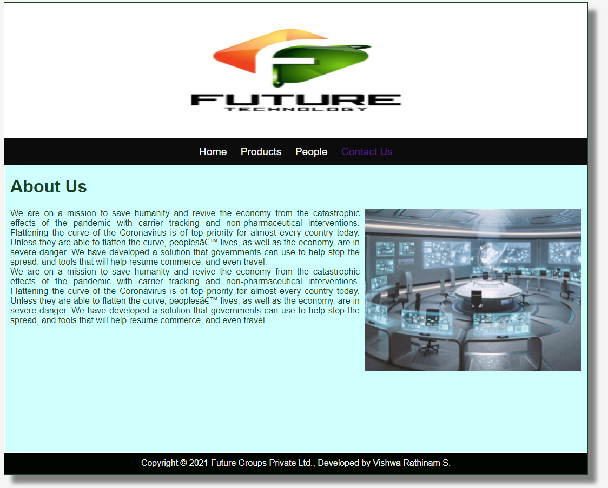
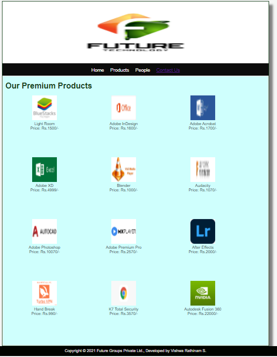
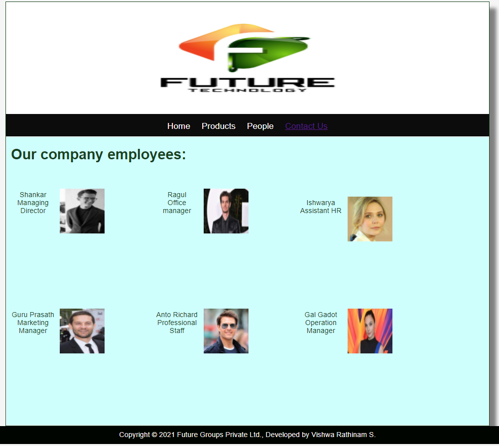
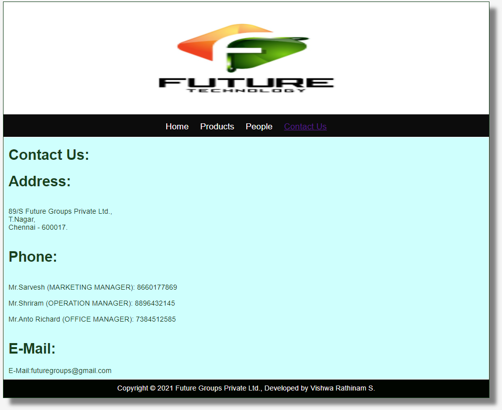

# Web Design for a Software Product Company

## AIM:

To design a static website for a software product company company.

## DESIGN STEPS:

### Step 1:

Requirement collection.

### Step 2:

Creating the layout using HTML and CSS.

### Step 3:

Updating the sample content.

### Step 4:

Choose the appropriate style and color scheme.

### Step 5:

Validate the layout in various browsers.

### Step 6:

Validate the HTML code.

### Step 6:

Publish the website in the given URL.

## PROGRAM :

### Layout.css:
~~~
* {
  box-sizing: border-box;
  font-family: Arial, Helvetica, sans-serif;
}
body {
  background-color: whitesmoke;
  color: #17421d;
}
.container {
  width: 1080px;
  margin-left: auto;
  margin-right: auto;
  border-width: 1px 1px 1px 1px;
  border-style: solid;
  box-shadow: 15px 15px 8px gray;
}

.banner {
  display: block;
  width: 100%;
  height: 250px;
  text-align: center;
  font-size: 60px;
  background-image: url("/static/img/logo.jpg");
  background-size: 100% 100%;
  margin: 0px 0px 0px 0px;
  padding-top: 150px;
  color: #3c16e6;
}

.menu {
  display: block;
  width: 100%;
  height: 50px;
  font-size: larger;
  background-color: #0c0c0c;
  text-align: center;
  padding-top: 15px;
  margin: 0px 0px 0px 0px;
  border-width: 1px;
}

.menuitem {
  display: inline-block;
  margin-left: 10px;
  margin-right: 10px;
}
.menuitemselected {
  display: inline-block;
  margin-left: 10px;
  margin-right: 10px;
  color: #ec370a;
}

.menuitem a {
  text-decoration: none;
  color: #fffefe;
}

.content {
  display: block;
  width: 100%;
  background-color: #cffffd;
  min-height: 500px;
  margin: 0px 0px 0px 0px;
  border-width: 1px;
  border-color: white;
  border-style: solid;
}
.homecontent {
  min-height: 500px;
  margin: 10px 10px 10px 10px;
}
.homecontent h1 {
  text-align: left;
}
.homecontent img {
  float: right;
  width: 400px;
  height: 300px;
  margin-left: 10px;
}

.contenttext {
  text-align: justify;
}

.productcontent {
  min-height: 500px;
  margin: 10px 10px 10px 10px;
}

.productcontent h1 {
  text-align: left;
}

.productitems {
  display: block;
}

.productitem {
  display: inline-block;
  width: 30%;
  height: 250px;
  text-align: center;
}

.productitem img {
  width: 100px;
  height: 100px;
  display: block;
}
.productitem .itemimage {
  display: block;
  margin-left: auto;
  margin-right: auto;
  width: 100px;
  margin-bottom: 5px;
}

.productitem .itemname {
  display: block;
}
.productitem .itemprice {
  display: block;
}

.footer {
  display: block;
  width: 100%;
  height: 40px;
  background-color: #010500;
  text-align: center;
  padding-top: 10px;
  margin: 0px 0px 0px 0px;
  color: #f7f2f2;
}
~~~
### Home Page:
~~~
<!DOCTYPE html>
<html lang="en">
  <head>
    <title>Future Groups Private Ltd.,</title>
    <link rel="stylesheet" href="./css/layout.css" />
    <link rel="icon" href="./img/icon.png" type="image/x-icon" />
  </head>

  <body>
    

      

      

        
<a href="/static/home.html">Home</a>

        
<a href="/static/products.html">Products</a>

        
<a href="/static/people.html">People</a>

        
<a href="/static/contactus.html">Contact Us</a>

        

      

        

          <h1>About Us</h1>
          
          

            We are on a mission to save humanity and revive the economy from the catastrophic effects of the pandemic with carrier tracking and non-pharmaceutical interventions.
            Flattening the curve of the Coronavirus is of top priority for almost every country today. Unless they are able to flatten the curve, peoples’ lives, as well as the economy, are in severe danger. We have developed a solution that governments can use to help stop the spread, and tools that will help resume commerce, and even travel.
             
            
            We are on a mission to save humanity and revive the economy from the catastrophic effects of the pandemic with carrier tracking and non-pharmaceutical interventions.
            Flattening the curve of the Coronavirus is of top priority for almost every country today. Unless they are able to flatten the curve, peoples’ lives, as well as the economy, are in severe danger. We have developed a solution that governments can use to help stop the spread, and tools that will help resume commerce, and even travel.
 
 
          

        

      

      

        Copyright &#169; 2021 Future Groups Private Ltd., Developed by Vishwa Rathinam S.
      

    

  </body>
</html>
~~~
### Products:
~~~
<!DOCTYPE html>
<html lang="en">
  <head>
    <title>Future Groups Private Ltd.,</title>
    <link rel="stylesheet" href="./css/layout.css" />
    <link rel="icon" href="./img/icon.png" type="image/x-icon" />
  </head>

  <body>
    

      

      

        
<a href="/static/home.html">Home</a>

        
<a href="/static/products.html">Products</a>

        
<a href="/static/people.html">People</a>

        
<a href="/static/contactus.html">Contact Us</a>

        

      

        
    
          <h1>Our Premium Products</h1>
          

              
 
                  

                  
                  

                  
Light Room

                  
Price: Rs.1500/- 

              

              
 
                  

                  
                  

                  
Adobe InDesign

                  
Price: Rs.1600/- 

              

              
 
                

                
                

                
Adobe Acrobat

                
Price: Rs.1700/- 

              

              
 
                

                
                

                
Adobe XD

                
Price: Rs.4999/- 

            

            
 
              

              
              

              
Blender

              
Price: Rs.1000/- 

          
  
 
            

            
            

            
Audacity

            
Price: Rs.1070/- 

          
  
 
            

            
            

            
Adobe Photoshop

            
Price: Rs.10070/- 

          
  
 
            

            
            

            
Adobe Premium Pro

            
Price: Rs.2570/- 

          
  
 
            

            
            

            
After Effects

            
Price: Rs.2000/- 

        

      
  
 
        

        
        

        
Hand Break

        
Price: Rs.990/- 

      
  
 
        

        
        

        
K7 Total Security

        
Price: Rs.3570/- 

      
  
 
        

        
        

        
Autodesk Fusion 360

        
Price: Rs.22000/- 

    

            

          

          
        
      

      

        Copyright &#169; 2021 Future Groups Private Ltd., Developed by Vishwa Rathinam S.
      

    

  </body>
</html>
~~~
### People:
~~~
<!DOCTYPE html>
<html lang="en">
  <head>
    <title>Future Groups Private Ltd.,</title>
    <link rel="stylesheet" href="./css/layout.css" />
    <link rel="icon" href="./img/ail.png" type="image/x-icon" />
    </head>
    <body>
    

      

      

        
<a href="/static/home.html">Home</a>

        
<a href="/static/products.html">Products</a>

        
<a href="/static/people.html">People</a>

        
<a href="/static/contactus.html">Contact Us</a>

        

      

        

          <h1>Our company employees:</h1>  
          

            
 
                

                
                

                
Shankar

                
Managing Director

            

            
 
                

                
                

                
Ragul

                
Office manager

            

            
 
              

              
              

              
Ishwarya

              
Assistant HR

            

            
 
              

              
              

              
Guru Prasath

              
Marketing Manager

          

          
 
            

            
            

            
Anto Richard

            
Professional Staff

        
  
 
          

          
          

          
Gal Gadot

          
Operation Manager

      

          

        

        
        
    

    

      Copyright &#169; 2021 Future Groups Private Ltd., Developed by Vishwa Rathinam S.
    

  

</body>
</html>
~~~
### Contact Us:
~~~
<!DOCTYPE html>
<html lang="en">
  <head>
    <title>Future Groups Private Ltd.,</title>
    <link rel="stylesheet" href="./css/layout.css" />
    <link rel="icon" href="./img/ail.png" type="image/x-icon" />
  </head>

  <body>
    

      

      

        
<a href="/static/home.html">Home</a>

        
<a href="/static/products.html">Products</a>

        
<a href="/static/people.html">People</a>

        
<a href="/static/contactus.html">Contact Us</a>

      

      

        

          <h1>Contact Us:</h1>
          <h1>Address:</h1> 
          

            89/S Future Groups Private Ltd., 
            T.Nagar, 
            Chennai - 600017.
          
 
          <h1>Phone:</h1> 
          

              Mr.Sarvesh  (MARKETING MANAGER): 8660177869  
              Mr.Shriram (OPERATION MANAGER): 8896432145  
              Mr.Anto Richard (OFFICE MANAGER): 7384512585  
          

          <h1>E-Mail:</h1>
          

              E-Mail:futuregroups@gmail.com
          

        

      

      

        Copyright &#169; 2021 Future Groups Private Ltd., Developed by Vishwa Rathinam S.
      

    

  </body>
</html>
~~~
## OUTPUT:

### Home Page:

### Products:

### People:

### Contact Us:

## Result:

Thus a website is designed for the software product company and the HTML,CSS code are validated.
